# Serifu for Adobe InDesign

This is an extension that allows for the convenient use of Serifu-formatted scripts when lettering manga or other comics with Adobe InDesign. Its primary features are:

- A dynamically-updated view of the script data
- Automatic sequential placing of script text
- One-click staging of text frames
- Linking of InDesign's paragraph styles to Sources and Styles in the script

## Installation

Due to constraints in how Adobe deals with extensions, installing the Serifu extension is slightly convoluted. I highly recommend using [Anastasiy's Extension Manager](https://install.anastasiy.com), which is unofficial but also Adobe-endorsed. 

First, download and install the appropriate version of Anastasiy's Extension Manager for your platform.

Then, download the Serifu extension zip. This contains the extension itself, `com.serifu.panel.zxp`, along with an example IDML file and Serifu script data.

Open Anastasiy's Extension Manager, select "InDesign," and click "Install."

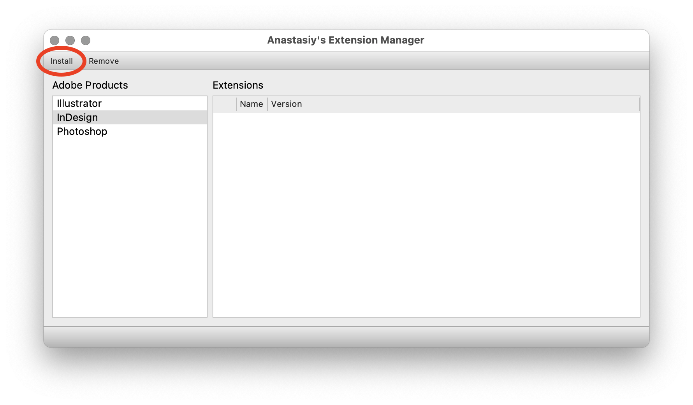

Navigate to `com.serifu.panel.zxp`, and select it.

Once installation is complete, you should be able to launch InDesign and locate the "Serifu" item under Window -> Extensions.

## Use

### Opening and Navigating a Serifu-formatted script file

Open the Serifu extension by selecting it from the Window -> Extensions menu in InDesign. Upon its successful launch, this is what you'll see:

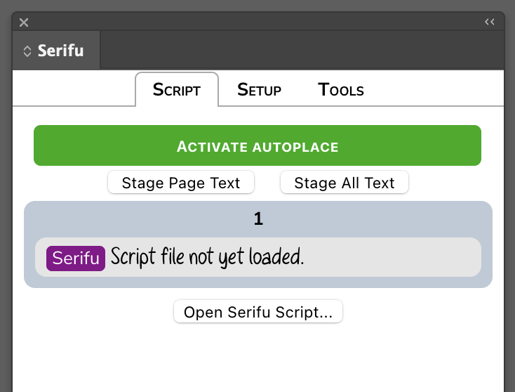

Clicking the "Open Serifu Script..." button at the bottom will bring up a standard file-picking dialogue box. Navigate to the script you want to load, and open it. If you open the sample script included in the Serifu download, this is what you'll see upon loading it this way:

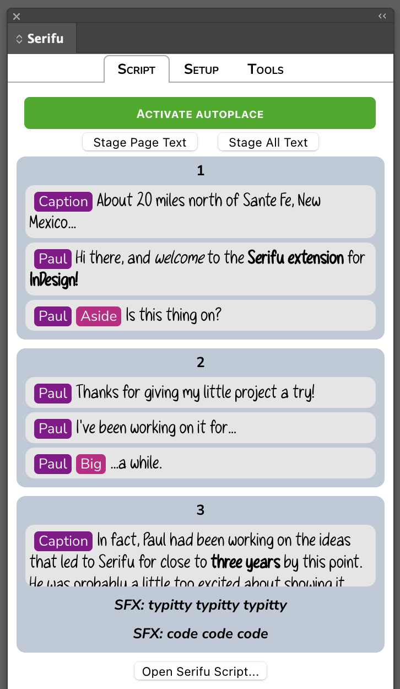

The Serifu extension automatically displays the script page corresponding to the currently active InDesign page. Try moving to another page in InDesign, and you'll notice the Serifu panel update with the script text for that page.

### Placing Text

There are two ways to move text from an open Serifu script into your InDesign document: Autoplacing, and staging.

#### Autoplacing

If your workflow involves placing empty text frames first and filling them with text later, the Autoplace tool is meant to make this easier and faster. It tries to behave similarly to InDesign's Place tool, which allows you to quickly place a series of images in a document.

You can activate Autoplace by clicking the green "Activate Autoplace" button. Clicking this button again will deactivate Autoplace.

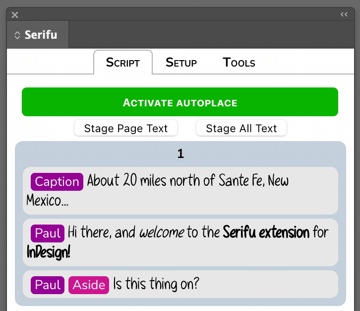

When Autoplace is active, the Serifu extension highlights the line that will be placed next. To place the text from the highlighted line into a text frame, simply select that text frame in InDesign.

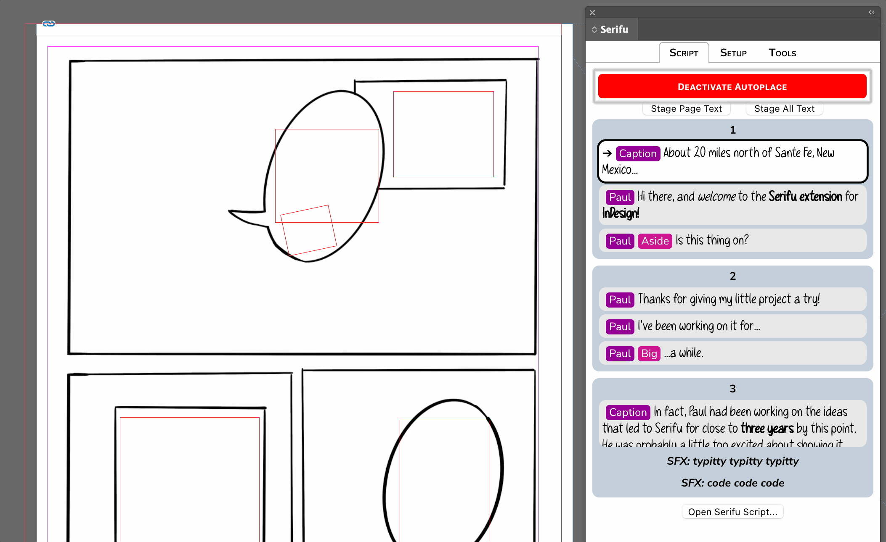

The text will be placed in the frame, and the next line will be highlighted in the Serifu panel.

To skip ahead over a line without placing any text, press space while Autoplace is active. Pressing shift-space will let you move backwards. You can also click on any line while Autoplace is active in order to set it as the next line to be placed. 

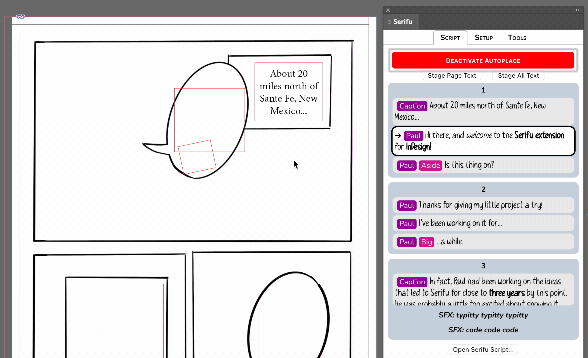

**NOTE:** The Serifu panel must have interface focus for space and shift-space navigation to function. This is a limitation of InDesign's extension architecture, unfortunately. If you're hitting space and the selection isn't advancing, try clicking in the Serifu panel to make sure it is in the foreground and has focus.

Your position in the line queue will persist as long as you remain on a given InDesign page. Moving to another page always resets the Autoplace queue to the first line.

#### Staging

If you prefer, Serifu can also automatically create text frames that are pre-populated with text from the script. This is called "staging." You can stage either the text for the current page, or the entire document.

To see how text staging works, try clicking the "Stage Page Text" button near the top of the script display.

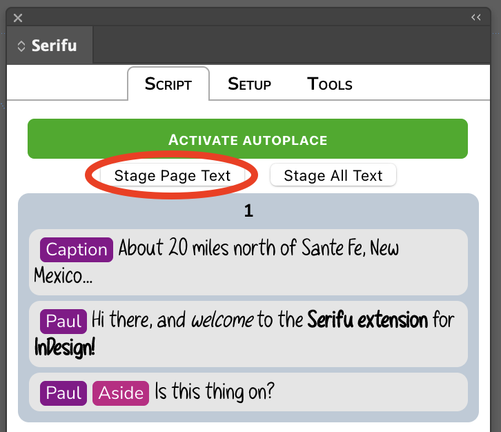

When Serifu stages text, it creates one row of text frames for each panel specified in the script, situated just past the outside edge of the page. Within a row, the text frame closest to the edge of the page is the first text in that panel, then the second, and so on.

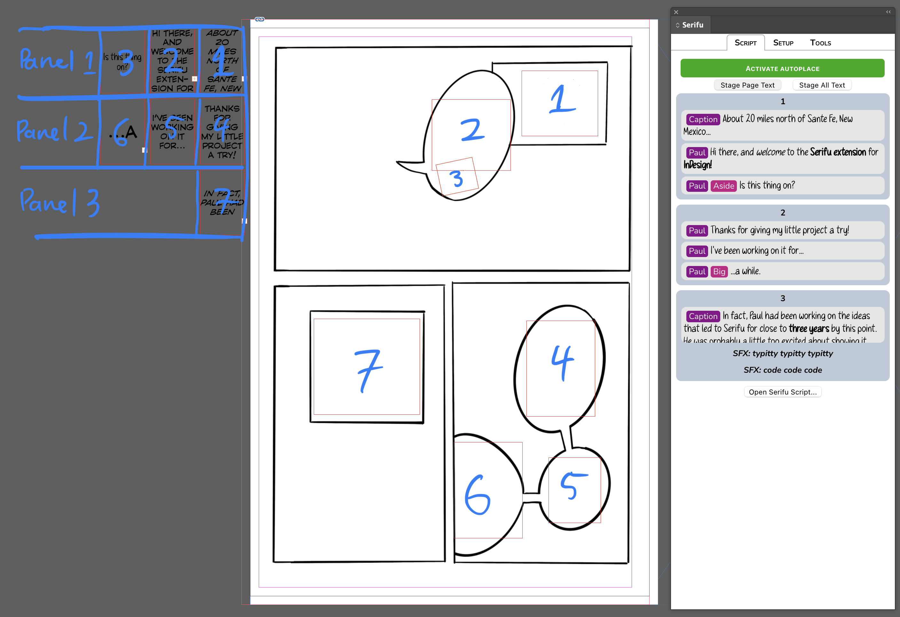

### Placing SFX

Clicking on an SFX line in the script panel creates a text box in the center of the current InDesign page, with the "SFX" paragraph style already applied. 

In the Setup tab, there are several different options available for what parts of the script text is included in an SFX text box. 

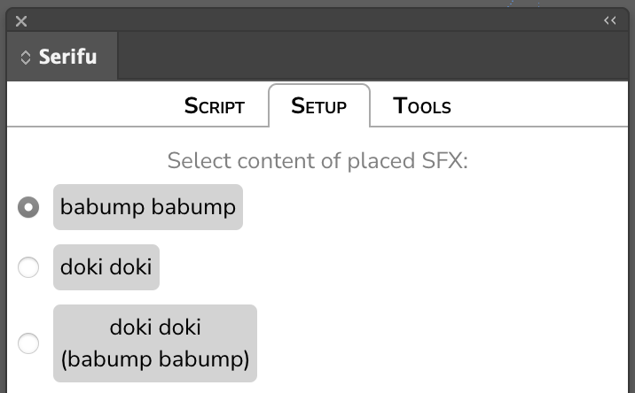

### Paragraph Style Association

Serifu scripts associate every line of text with a mandatory **Source**, and an optional **Style**. A line's Source is most often the name of the character speaking it, but can also be a description of its role on the page, e.g. `Caption` or `Chapter Title`, or an indication of diegetic text like `Sign` or `Menu`.

A line's Style, meanwhile, is meant to indicate that the line's text is treated differently from whatever the default for that Source would be. Styles are most frequently used to indicate character dialogue whose text needs to use a different font, like `Aside`, `Screaming`, `Whisper`, etc.

When you load a Serifu script, the extension builds a list of every Source and Style that appears in the script. You can see this list by clicking on the Setup tab.

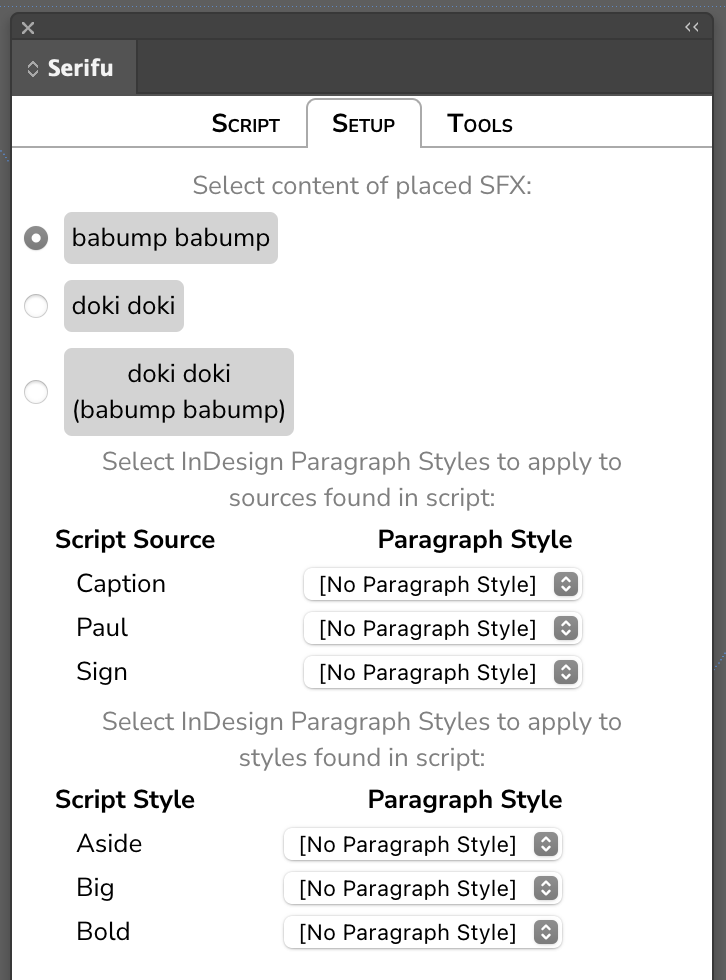

Next to each Source and Style is a selection menu. This menu contains all the paragraph styles currently defined in your InDesign document.

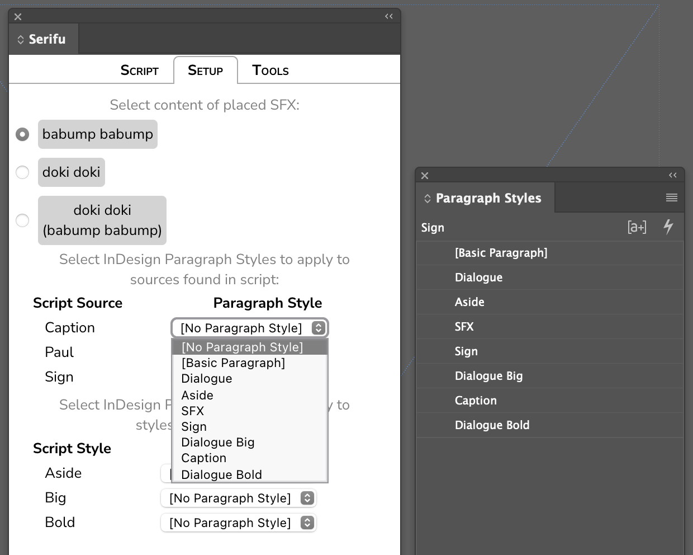

When you select a given paragraph style for a given Source or Style, whenever Serifu places text with that Source or Style—either via Autoplace or staging—it will automatically apply the selected paragraph style.

If no paragraph style is chosen for a given Source or Style, the default InDesign style of `[No Paragraph Style]` will be used.

### Inline Styles: Bold, Ital, and BoldItal

Individual lines of text in Serifu may contain sections of bolded, italicized, or bold italicized text. These will be visible as such in the script panel:

When you place a line like this, either via autoplace or staging, Serifu looks for an InDesign character style to apply to them. Specifically, it looks for a character style with the name of the paragraph style it would otherwise apply, followed by the words "Bold", "Ital", or "BoldItal", depending on which type of inline style was applied.

For example, if you've defined a paragraph style called `Caption`, when Serifu encounters italics in the context of applying the `Caption` paragraph style, it will apply a character style named `Basic Caption Ital`. If that character style doesn't already exist, it is created, then applied.

When Serifu creates character styles to apply like this, it doesn't make any assumptions about how those styles should be defined. In this case, in our example of `Caption Ital`, to make it actually italicize text, you will need to manually edit the character style to display the italic version of the appropriate font.

## Feedback

If something is broken (which is quite possible) or something could be improved (which is almost certain) I would love to hear any feedback you have. You can email me at pts@sockdolager.net, or use [this feedback form](https://airtable.com/shrhauvfc3qLoo4vk) to submit a bug report or feature request.